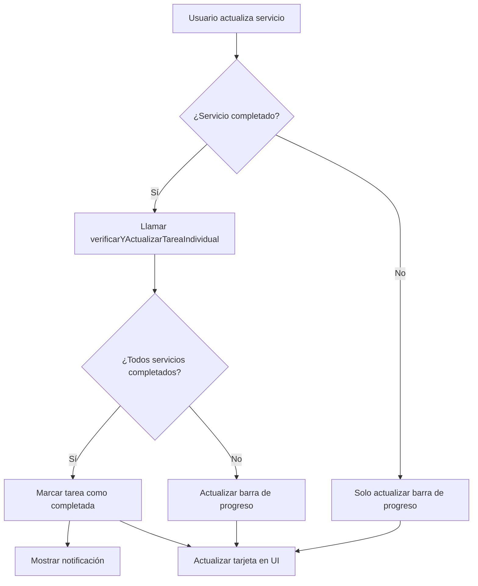

# 📊 Barra de Progreso de Servicios en Tarjetas de Tareas

## 🎯 Descripción

Se ha implementado una nueva funcionalidad visual que muestra el progreso de completitud de los servicios asociados a cada tarea mediante una barra de progreso delgada y animada.

## ✨ Características Implementadas

### 1. **Barra de Progreso Visual**
- Barra delgada (6px de altura) ubicada justo debajo del header de cada tarjeta de tarea
- Gradiente de color verde que se llena según el porcentaje de servicios completados
- Animación tipo "shimmer" que da dinamismo visual
- Tooltip que muestra información detallada al pasar el mouse

### 2. **Cálculo Automático de Progreso**
- Cuenta automáticamente cuántos servicios están asignados a cada tarea
- Calcula el porcentaje de servicios completados
- Muestra el progreso en formato visual y textual (ej: "3/5 servicios")

### 3. **Autocompletado de Tareas**
- **Verificación Automática**: Cuando todos los servicios de una tarea están en estado "completado", la tarea se marca automáticamente como completada
- **Verificación al Cargar**: Al refrescar la vista de tareas, el sistema verifica todas las tareas pendientes
- **Verificación Individual**: Se puede llamar después de actualizar un servicio para verificar si la tarea debe completarse
- **Notificación al Usuario**: Muestra una notificación cuando una tarea se completa automáticamente

## 📁 Archivos Modificados

### 1. `tareas-tab/tareas-cards.css`
**Nuevos estilos agregados:**

```css
/* Progress bar container - barra delgada de progreso */
.tarea-progress-container {
    width: 100%;
    height: 6px;
    background: var(--gris-claro);
    border-bottom: 2px solid var(--border-color);
    position: relative;
    overflow: hidden;
}

.tarea-progress-bar {
    height: 100%;
    background: linear-gradient(90deg, var(--verde-oliva) 0%, var(--prioridad-baja) 100%);
    transition: width 0.5s ease-in-out;
    position: relative;
}

.tarea-progress-bar::after {
    content: '';
    animation: shimmer 2s infinite;
}

@keyframes shimmer { ... }

.tarea-progress-bar.completed {
    background: linear-gradient(90deg, var(--prioridad-baja) 0%, #43A047 100%);
}

.tarea-progress-info {
    /* Tooltip con información de progreso */
}
```

### 2. `tareas-tab/tareas-module.js`

**Variables Globales Añadidas:**
```javascript
let todosLosServiciosCache = []; // Cache de servicios para calcular progreso
```

**Funciones Modificadas:**

#### `crearTarjetaTarea(tarea, todosServicios = [])`
- Ahora acepta array de servicios como segundo parámetro
- Calcula progreso de servicios
- Renderiza barra de progreso en el HTML

**HTML generado:**
```html
<div class="tarea-progress-container" title="X de Y servicios completados">
    <div class="tarea-progress-bar [completed]" style="width: Z%"></div>
    <span class="tarea-progress-info">X/Y servicios</span>
</div>
```

#### `refrescarTarjetasTareas()`
- Carga tareas Y servicios en paralelo usando `Promise.all`
- Almacena servicios en caché global
- Llama a `verificarYActualizarTareasCompletadas()` después de cargar

#### `renderizarLoteTareas(container)`
- Pasa `todosLosServiciosCache` a `crearTarjetaTarea()`

#### `actualizarTarjetaTarea(tareaId)`
- Recarga servicios antes de actualizar la tarjeta
- Pasa servicios actualizados a `crearTarjetaTarea()`

**Nuevas Funciones:**

#### `verificarYActualizarTareasCompletadas()`
```javascript
/**
 * Verifica todas las tareas y marca como completadas aquellas
 * donde todos sus servicios están completados
 * Se ejecuta automáticamente al cargar tareas
 */
```

**Lógica:**
1. Itera sobre todas las tareas pendientes/en proceso
2. Para cada tarea, obtiene sus servicios asignados
3. Si todos los servicios están completados, actualiza la tarea a "completada"
4. Muestra notificación con el número de tareas autocompletadas

#### `verificarYActualizarTareaIndividual(tareaId)`
```javascript
/**
 * Verifica y actualiza el estado de UNA tarea específica
 * basándose en el estado de sus servicios
 * Útil para llamar después de actualizar un servicio
 */
```

**Uso sugerido:**
```javascript
// Después de actualizar un servicio
await actualizarServicio(servicioId, nuevosDatos);
await verificarYActualizarTareaIndividual(tareaId);
```

## 🎨 Diseño Visual

### Estados de la Barra

1. **Sin Servicios**: No se muestra la barra
2. **Progreso Parcial**: Barra con gradiente verde, ancho = porcentaje completado
3. **100% Completado**: Barra con gradiente verde más intenso y clase `.completed`

### Colores
- Inicio del gradiente: `var(--verde-oliva)` → Verde oliva del sistema
- Fin del gradiente: `var(--prioridad-baja)` → Verde claro
- Completado: Gradiente de verde claro a verde oscuro (#43A047)

### Animaciones
- **Transición de ancho**: 0.5s ease-in-out
- **Efecto shimmer**: Brillo animado que recorre la barra cada 2s

## 🔄 Flujo de Actualización Automática



## 📌 Notas Importantes

### Condiciones para Autocompletado
- La tarea debe tener al menos 1 servicio asignado
- TODOS los servicios deben estar en estado "completado"
- La tarea NO debe estar ya en estado "completada" o "cancelada"

### Performance
- Los servicios se cargan una sola vez al inicio y se cachean
- Se recargan solo cuando se actualiza una tarjeta individual
- Carga en paralelo de tareas y servicios optimiza el tiempo inicial

### Compatibilidad
- Funciona con el sistema de lazy loading existente
- Compatible con filtros y búsquedas
- Responsive y funciona en diferentes tamaños de pantalla

## 🔧 Funciones Expuestas Globalmente

```javascript
// Disponibles en window
window.verificarYActualizarTareaIndividual(tareaId)
window.cargarProximosVencimientos()
```

## 💡 Uso Recomendado

Para integrar la verificación automática cuando se actualiza un servicio desde otro módulo:

```javascript
// En el módulo que actualiza servicios
async function completarServicio(servicioId) {
    // ... actualizar servicio ...
    
    // Obtener tarea asociada
    const servicio = await obtenerServicio(servicioId);
    
    if (servicio.tarea_id && window.verificarYActualizarTareaIndividual) {
        // Verificar si la tarea debe completarse
        await window.verificarYActualizarTareaIndividual(servicio.tarea_id);
    }
}
```

## ✅ Testing

Para probar la funcionalidad:

1. **Crear una tarea** con varios servicios asignados
2. **Completar servicios gradualmente** y observar la barra de progreso llenarse
3. **Completar el último servicio** y verificar que:
   - La barra llega al 100%
   - La tarea se marca automáticamente como completada
   - Aparece una notificación de éxito
   - El badge de estado cambia a "Completada"

## 🎉 Resultado Final

La funcionalidad proporciona:
- **Visibilidad instantánea** del progreso de cada tarea
- **Menos interacción manual** al marcar tareas completadas
- **Experiencia de usuario mejorada** con feedback visual claro
- **Automatización inteligente** que reduce errores humanos

---

**Fecha de implementación**: 24 de noviembre de 2025
**Versión**: 1.0
