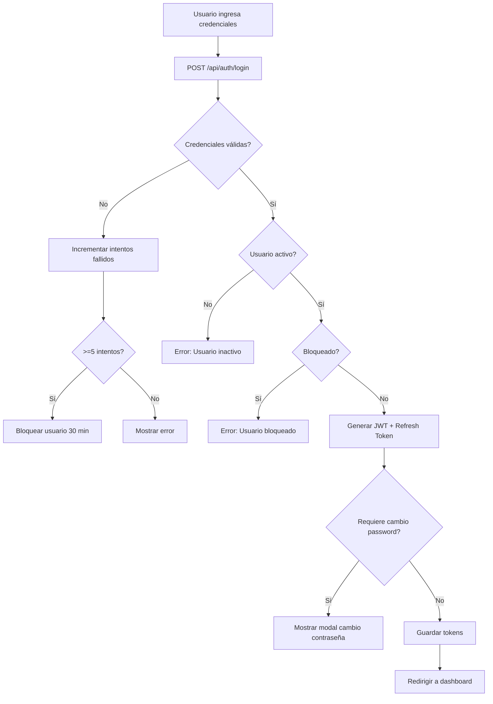

# Módulo de Login - Manual Técnico

## 1. Descripción General

El módulo de **Login** gestiona la autenticación de usuarios en el sistema SGSOM (Sistema de Gestión de Servicios, de Mantenimiento, Habitaciones y Espacios Comunes) del JW Marriott Los Cabos.

### Características principales:
- Autenticación JWT (JSON Web Tokens)
- Manejo de sesiones con refresh tokens
- Protección contra intentos fallidos (bloqueo después de 5 intentos)
- Cambio de contraseña obligatorio
- Recuperación de contraseña mediante solicitud al administrador
- Soporte para tema claro/oscuro
- Almacenamiento en IndexedDB y localStorage/sessionStorage

## 2. Estructura de Archivos

```
├── login.html              # Página principal de login
├── js/

│   ├── login-jwt.js        # Script principal con autenticación JWT
│   ├── indexeddb-manager.js # Gestor de IndexedDB para almacenamiento
│   └── storage-helper.js   # Helper para manejo de storage
├── css/
│   └── login-style.css     # Estilos del módulo de login
├── api/
│   ├── auth.js             # Funciones de autenticación JWT
│   └── auth-routes.js      # Rutas de la API de autenticación
```

## 3. Flujo de Autenticación



## 4. API Endpoints

### 4.1 Login
```
POST /api/auth/login
```
**Request Body:**
```json
{
    "email": "usuario@jwmarriott.com",
    "password": "contraseña123"
}
```

**Response (200 OK):**
```json
{
    "success": true,
    "mensaje": "Login exitoso",
    "usuario": {
        "id": 1,
        "nombre": "Nombre Usuario",
        "email": "usuario@jwmarriott.com",
        "numero_empleado": "EMP-001",
        "departamento": "Mantenimiento",
        "telefono": "+52 624 XXX XXXX",
        "rol": "ADMIN",
        "permisos": {...},
        "requiere_cambio_password": false
    },
    "tokens": {
        "accessToken": "eyJhbGciOiJI...",
        "refreshToken": "abc123...",
        "expiresIn": "2025-11-30T16:00:00.000Z",
        "tokenType": "Bearer"
    },
    "sesion_id": 15
}
```

### 4.2 Logout
```
POST /api/auth/logout
Authorization: Bearer <token>
```

### 4.3 Refresh Token
```
POST /api/auth/refresh
```
**Request Body:**
```json
{
    "refreshToken": "abc123..."
}
```

### 4.4 Información del Usuario
```
GET /api/auth/me
Authorization: Bearer <token>
```

### 4.5 Contacto del Administrador
```
GET /api/auth/contacto-admin
```

### 4.6 Solicitar Acceso
```
POST /api/auth/solicitar-acceso
```
**Request Body:**
```json
{
    "nombre": "Nombre Completo",
    "email": "correo@ejemplo.com",
    "telefono": "+52 624 XXX XXXX",
    "departamento": "Departamento",
    "motivo": "Descripción del motivo"
}
```

### 4.7 Cambio de Contraseña Obligatorio
```
POST /api/auth/cambiar-password-obligatorio
Authorization: Bearer <token>
```
**Request Body:**
```json
{
    "passwordActual": "contraseña123",
    "nuevoPassword": "nuevaContraseña456",
    "confirmarPassword": "nuevaContraseña456"
}
```

## 5. Componentes Frontend

### 5.1 Formulario de Login
- Campo email con validación
- Campo contraseña con toggle de visibilidad
- Checkbox "Recordarme" (usa localStorage vs sessionStorage)
- Link "¿Olvidaste tu contraseña?"

### 5.2 Modal de Recuperación de Contraseña
- Formulario para solicitar acceso al administrador
- Campos: nombre, correo, teléfono (opcional), comentarios
- Muestra información de contacto del administrador

### 5.3 Modal de Cambio de Contraseña Obligatorio
- Se muestra cuando `requiere_cambio_password = true`
- Campos: contraseña actual, nueva contraseña, confirmar contraseña
- Validación de mínimo 8 caracteres
- No permite reutilizar contraseña anterior

## 6. Seguridad

### 6.1 Configuración JWT
```javascript
const JWT_SECRET = process.env.JWT_SECRET;
const JWT_EXPIRATION = '8h';
const REFRESH_TOKEN_EXPIRATION = '7d';
```

### 6.2 Protecciones Implementadas
- **Hash de contraseñas**: Función `hashear_password()` en PostgreSQL
- **Verificación**: Función `verificar_password()` en PostgreSQL
- **Intentos fallidos**: Máximo 5 intentos antes de bloqueo
- **Tiempo de bloqueo**: 30 minutos
- **Auditoría**: Registro de intentos fallidos en tabla `auditoria_usuarios`
- **Sesiones**: Registro en tabla `sesiones_usuarios` con información del dispositivo

### 6.3 Información del Dispositivo Capturada
- IP del cliente
- User-Agent
- Tipo de dispositivo (Desktop/Mobile/Tablet)
- Navegador (Chrome, Safari, Firefox, Edge)
- Sistema operativo (Windows, macOS, Linux, Android, iOS)

## 7. Almacenamiento de Datos

### 7.1 IndexedDB (Primary)
- Tokens de acceso y refresh
- Información del usuario
- Configuración de sesión

### 7.2 localStorage/sessionStorage (Fallback)
Claves utilizadas:
- `accessToken`
- `refreshToken`
- `tokenExpiration`
- `tokenType`
- `sesionId`
- `currentUser`
- `theme` (tema de la interfaz)

## 8. Roles y Permisos

### 8.1 Roles del Sistema
| Rol | Descripción |
|-----|-------------|
| ADMIN | Acceso completo al sistema |
| SUPERVISOR | Supervisión de operaciones y personal |
| TECNICO | Operaciones de mantenimiento |

### 8.2 Middleware de Autorización
```javascript
// Verificar autenticación
verificarAutenticacion(req, res, next)

// Solo administradores
verificarAdmin(req, res, next)

// Supervisores y administradores
verificarSupervisor(req, res, next)
```

## 9. Base de Datos

### 9.1 Tablas Relacionadas
- `usuarios`: Información de usuarios
- `roles`: Definición de roles y permisos
- `sesiones_usuarios`: Control de sesiones activas
- `auditoria_usuarios`: Registro de actividades
- `historial_passwords`: Historial de contraseñas

### 9.2 Campos de Usuario Relevantes
```sql
usuarios (
    id SERIAL PRIMARY KEY,
    nombre VARCHAR(100),
    email VARCHAR(100) UNIQUE,
    password_hash VARCHAR(255),
    rol_id INTEGER REFERENCES roles(id),
    activo BOOLEAN DEFAULT TRUE,
    bloqueado_hasta TIMESTAMP,
    intentos_fallidos INTEGER DEFAULT 0,
    requiere_cambio_password BOOLEAN DEFAULT FALSE,
    numero_empleado VARCHAR(50),
    departamento VARCHAR(100),
    telefono VARCHAR(20),
    fecha_baja TIMESTAMP,
    created_at TIMESTAMP DEFAULT CURRENT_TIMESTAMP
)
```

## 10. Manejo de Errores

### 10.1 Códigos de Error HTTP
| Código | Descripción |
|--------|-------------|
| 400 | Datos incompletos o inválidos |
| 401 | Credenciales inválidas o token expirado |
| 403 | Usuario inactivo o bloqueado |
| 404 | Usuario no encontrado |
| 500 | Error interno del servidor |

### 10.2 Mensajes de Error
- "Email y contraseña son requeridos"
- "Email o contraseña incorrectos"
- "Usuario bloqueado por múltiples intentos fallidos"
- "Esta cuenta ha sido desactivada"
- "Token de autenticación no proporcionado"
- "Token de autenticación inválido o expirado"

## 11. Funciones Principales (Frontend)

### 11.1 Inicialización
```javascript
async function initializeAuth()
```
Verifica tokens existentes y redirige al dashboard si son válidos.

### 11.2 Peticiones Autenticadas
```javascript
async function fetchWithAuth(url, options = {})
```
Añade automáticamente el token JWT a las peticiones.

### 11.3 Refresh de Token
```javascript
async function refreshAccessToken()
```
Renueva el access token usando el refresh token.

### 11.4 Limpiar Datos de Autenticación
```javascript
function clearAuthData()
```
Elimina todos los datos de sesión de storage.

## 12. Dependencias

### Backend
- `express`: Framework web
- `jsonwebtoken`: Manejo de JWT
- `pg`: Cliente PostgreSQL
- `cors`: Manejo de CORS

### Frontend
- Font Awesome 6.5.1 (iconos)
- IndexedDB API
- Web Storage API
